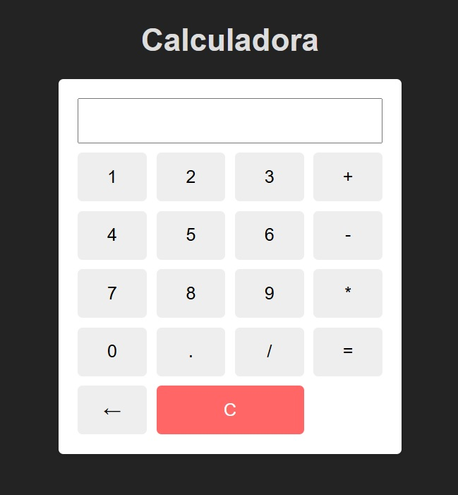

# 🧮 Calculadora Web

Se trata de una calculadora básica hecha con **HTML, CSS y JavaScript**. Permite que realizemos operaciones matemáticas simples como suma, resta, multiplicación y división. Es un pequeño proyecto creado como parte de mi portfolio para practicar html, css y lógica en JavaScript.

---

## 📸 Vista previa

 
---

## 🚀 Tecnologías usadas

- HTML5
- CSS3
- JavaScript (vanilla)
- Git & GitHub

---

## 🎯 Funcionalidades

- Botones numéricos y de operaciones
- Botón de "C" para limpiar la pantalla
- Botón de "←" para eliminar uno a uno el último caracter
- Estilo visual simple y moderno

---

## 📂 Cómo usar

1. Cloná el repositorio:
   ```bash
   git clone https://github.com/Gabrielamorinigo/Calculadora-.git
